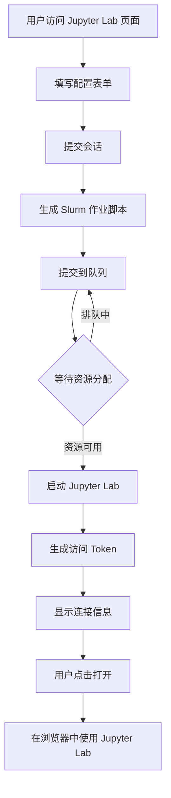

# Jupyter Lab 集成完成

> 适用范围：项目文档知识沉淀与协作参考
> 主入口链接：`docs/README.md`
> 文档状态：`archived`
> 最后验证日期：`2026-03-27`

## ✅ 集成概述

Jupyter Lab 已成功集成到 HPC 管理平台,作为一个交互式Python开发环境,用户可以直接从系统桌面启动和管理 Jupyter Lab 会话。

---

## 📦 已完成的工作

### 1. **应用定义文件** ✅
- **文件路径**: `/opt/my-hpcapp/lib/applications/ai/jupyter.ts`
- **功能**:
  - 定义了 Jupyter Lab 的资源配置(4个配置档案)
  - 支持 GPU 加速
  - 自动安装 Python 包
  - 生成 Slurm 作业脚本

### 2. **国际化翻译** ✅
- **文件路径**:
  - `/opt/my-hpcapp/messages/zh.json`
  - `/opt/my-hpcapp/messages/en.json`
- **覆盖内容**:
  - 界面文本(中文/英文)
  - 表单字段说明
  - 资源配置描述

### 3. **用户界面** ✅
- **文件路径**: `/opt/my-hpcapp/app/[locale]/dashboard/jupyter/page.tsx`
- **功能**:
  - 启动新的 Jupyter Lab 会话
  - 查看和管理活跃会话
  - 复制访问 Token
  - 一键打开 Jupyter Lab
  - 终止会话

### 4. **API 路由** ✅
- **文件路径**:
  - `/opt/my-hpcapp/app/api/jupyter/sessions/route.ts` (GET, POST)
  - `/opt/my-hpcapp/app/api/jupyter/sessions/[jobId]/route.ts` (DELETE)
- **功能**:
  - 创建 Jupyter Lab 会话(提交 Slurm 作业)
  - 获取用户会话列表
  - 终止会话

### 5. **系统桌面集成** ✅
- **文件路径**: `/opt/my-hpcapp/app/[locale]/dashboard/page.tsx`
- **功能**:
  - 添加了"AI工具"卡片
  - Jupyter Lab 快捷入口
  - 预留 PyTorch 和 vLLM 入口

### 6. **注册脚本** ✅
- **文件路径**: `/opt/my-hpcapp/scripts/register-jupyter-app.ts`
- **功能**:
  - 将 Jupyter Lab 注册到应用数据库
  - 验证应用定义
  - 提供部署指导

---

## 🚀 部署步骤

### 步骤 1: 安装 Jupyter Lab 环境

```bash
# 创建 Python 虚拟环境
sudo mkdir -p /opt/software
cd /opt/software
sudo python3.11 -m venv jupyter-env

# 激活环境
sudo /opt/software/jupyter-env/bin/pip install --upgrade pip

# 安装 Jupyter Lab 和常用包
sudo /opt/software/jupyter-env/bin/pip install \
  jupyterlab==4.0.* \
  notebook \
  ipywidgets \
  numpy \
  pandas \
  matplotlib \
  seaborn \
  scikit-learn \
  scipy
```

### 步骤 2: (可选) 安装 AI/ML 库

```bash
# 安装 PyTorch (CPU版本)
sudo /opt/software/jupyter-env/bin/pip install torch torchvision torchaudio --index-url https://download.pytorch.org/whl/cpu

# 或安装 PyTorch (GPU版本 - CUDA 12.1)
sudo /opt/software/jupyter-env/bin/pip install torch torchvision torchaudio --index-url https://download.pytorch.org/whl/cu121

# 安装 TensorFlow
sudo /opt/software/jupyter-env/bin/pip install tensorflow

# 安装其他常用库
sudo /opt/software/jupyter-env/bin/pip install \
  transformers \
  datasets \
  pillow \
  opencv-python \
  plotly
```

### 步骤 3: 配置环境模块 (可选)

如果使用 Environment Modules:

```bash
# 创建模块文件
sudo mkdir -p /usr/share/modules/modulefiles/jupyter
sudo nano /usr/share/modules/modulefiles/jupyter/4.0

# 添加内容:
#%Module1.0
proc ModulesHelp { } {
  puts stderr "Jupyter Lab 4.0 - Interactive Python environment"
}

module-whatis "Jupyter Lab 4.0"

prepend-path PATH /opt/software/jupyter-env/bin
setenv JUPYTER_CONFIG_DIR $::env(HOME)/.jupyter
```

### 步骤 4: 注册应用到系统

```bash
cd /opt/my-hpcapp

# 运行注册脚本
npx tsx scripts/register-jupyter-app.ts
```

预期输出:
```
====================================
注册 Jupyter Lab 应用到系统
====================================

1. 验证应用定义...
✅ 应用定义验证通过

2. 注册应用到数据库...
✅ Jupyter Lab 应用注册成功

3. 验证注册结果...
✅ 应用注册验证成功

应用信息:
  名称: hpcApps.jupyter.metadata.displayName
  版本: 4.0
  分类: development-tools
  类型: jupyter, web, interactive
  标签: jupyter, notebook, python, interactive, data-science, ai

====================================
✅ Jupyter Lab 应用集成完成!
====================================
```

### 步骤 5: 配置 Slurm 分区

确保以下 Slurm 分区已配置:

```bash
# 查看分区配置
sinfo -o "%P %a %l %D %N"
```

所需分区:
- **interactive**: 用于标准和轻量级配置
- **gpu**: 用于 GPU 加速配置
- **highmem**: 用于大内存配置

### 步骤 6: 测试部署

```bash
# 1. 重启 Next.js 应用
pm2 restart hpc-management-platform

# 2. 访问系统
# 打开浏览器访问: http://your-server/dashboard

# 3. 点击 "AI工具" 卡片中的 "Jupyter Lab"

# 4. 配置并启动一个测试会话:
#    - 会话名称: test-jupyter
#    - 资源配置: 轻量级
#    - 运行时长: 2小时
#    - 点击 "启动 Jupyter Lab"

# 5. 等待会话启动(约1-3分钟)

# 6. 会话状态变为 "RUNNING" 后,点击 "打开 Jupyter Lab"

# 7. 使用显示的 Token 登录
```

---

## 📋 功能特性

### 资源配置选项

1. **轻量级** (2核心, 8GB, 4小时)
   - 适合数据探索和简单计算

2. **标准** (4核心, 16GB, 8小时) - 推荐
   - 适合一般数据分析和机器学习

3. **GPU** (8核心, 32GB, 1xGPU, 8小时)
   - 适合深度学习和 GPU 加速计算

4. **大内存** (16核心, 128GB, 12小时)
   - 适合大规模数据处理

### GPU 支持

- ✅ 支持多个 GPU (1/2/4个)
- ✅ 支持不同 GPU 类型 (A100/V100/RTX3090)
- ✅ 自动加载 CUDA 模块

### 软件包管理

- ✅ 预安装常用科学计算库
- ✅ 用户自定义安装包列表
- ✅ 支持版本指定

### 会话管理

- ✅ 实时状态监控
- ✅ 一键打开 Jupyter Lab
- ✅ Token 自动生成和复制
- ✅ 会话终止

---

## 🔧 技术架构

```
用户界面 (dashboard/jupyter/page.tsx)
    ↓
API 路由 (/api/jupyter/sessions)
    ↓
Slurm 作业提交 (lib/slurm.ts)
    ↓
计算节点启动 Jupyter Lab
    ↓
用户访问 (浏览器)
```

---

## 📊 使用流程



---

## 🛠️ 故障排查

### 问题 1: 注册脚本失败

**解决方案**:
```bash
# 检查数据库连接
# 确保 SUPABASE_URL 和 SUPABASE_SERVICE_ROLE_KEY 环境变量已设置

# 查看详细错误
npx tsx scripts/register-jupyter-app.ts 2>&1 | tee register.log
```

### 问题 2: 会话提交失败

**原因**:
- Slurm 未运行
- 分区不存在
- 用户权限不足

**解决方案**:
```bash
# 检查 Slurm 状态
systemctl status slurmctld
systemctl status slurmd

# 检查分区
sinfo

# 检查用户配额
sacctmgr show assoc where user=username
```

### 问题 3: 无法访问 Jupyter Lab

**原因**:
- 防火墙阻止端口
- 计算节点网络配置问题

**解决方案**:
```bash
# 在计算节点检查 Jupyter 进程
ps aux | grep jupyter

# 检查端口监听
netstat -tlnp | grep 888

# 查看 Jupyter 日志
tail -f ~/.jupyter/logs/jupyter_*.out
```

### 问题 4: Python 包安装失败

**解决方案**:
```bash
# 手动测试安装
/opt/software/jupyter-env/bin/pip install numpy

# 检查网络连接
ping pypi.org

# 使用国内镜像
/opt/software/jupyter-env/bin/pip install -i https://pypi.tuna.tsinghua.edu.cn/simple numpy
```

---

## 📝 下一步扩展

### 短期扩展 (1-2周)

1. **添加预设模板**
   - 数据分析模板
   - 机器学习模板
   - 深度学习模板

2. **环境持久化**
   - 保存用户自定义包
   - 会话恢复功能

3. **性能监控**
   - CPU/内存使用率
   - GPU 利用率

### 中期扩展 (1个月)

1. **集成 PyTorch**
   - 类似 Jupyter Lab 的集成方式
   - 支持分布式训练

2. **集成 vLLM**
   - 大模型推理服务
   - OpenAI 兼容 API

3. **共享 Notebook**
   - 用户间共享 Notebook
   - 协作编辑功能

---

## 🎉 总结

Jupyter Lab 已成功集成到 HPC 管理平台:

✅ **应用定义** - 完整的资源配置和作业模板
✅ **用户界面** - 直观的会话管理界面
✅ **API 接口** - RESTful API 支持
✅ **系统集成** - 桌面快捷入口
✅ **文档完善** - 部署和使用指南

用户现在可以:
1. 从系统桌面一键启动 Jupyter Lab
2. 选择合适的资源配置
3. 自动安装所需的 Python 包
4. 在浏览器中使用完整的 Jupyter Lab 功能
5. 随时查看和管理会话

---

## 📚 相关文档

- [Jupyter Lab 官方文档](https://jupyterlab.readthedocs.io/)
- [AI 集成方案](./AI_INTEGRATION_PLAN.md)
- [前端风格指南](./FRONTEND_STYLE_GUIDE.md)

---

**创建时间**: 2025-10-22
**集成版本**: Jupyter Lab 4.0
**HPC 平台版本**: v0.1.0
