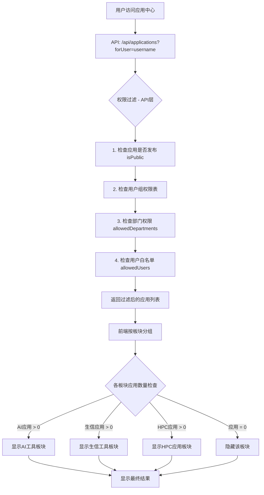

# 应用中心权限控制与动态板块显示

> 适用范围：功能模块长期知识（WebShell、VNC、应用中心等）
> 主入口链接：`docs/README.md`
> 文档状态：`active`
> 最后验证日期：`2026-03-27`

## 📋 功能概述

实现了**基于权限的动态板块显示**功能，用户只能看到自己有权限访问的应用板块。如果用户在某个板块（AI工具/生物信息/HPC应用）下没有任何可访问的应用，该板块将完全隐藏。

---

## ✨ 核心特性

### 1. **三大应用板块**
- 🤖 **AI开发工具** - 机器学习、深度学习、Jupyter等
- 🧬 **生物信息学工具** - BLAST、Salmon、Trinity等生信应用
- 🔬 **HPC应用** - 科学计算、CFD、有限元等传统HPC应用

### 2. **权限控制（API层）**
- ✅ 用户组权限检查（通过数据库函数 `check_user_application_permission`）
- ✅ 部门权限检查（`allowedDepartments`）
- ✅ 用户白名单（`allowedUsers`）
- ✅ 未发布应用自动过滤（`isPublic: false`）

### 3. **动态板块显示（前端）⭐**
- ✅ 自动识别应用类别并分组
- ✅ 空板块自动隐藏
- ✅ 板块标题显示应用数量
- ✅ 底部统计信息

---

## 🎨 界面效果

### 完整权限用户（管理员）
```
┌─────────────────────────────────────┐
│ 🔍 应用中心                         │
│ [搜索框] [分类筛选] [类型筛选]      │
├─────────────────────────────────────┤
│ 🤖 AI开发工具 (3)                  │
│ ┌──────┐ ┌──────┐ ┌──────┐         │
│ │Jupyter│ │PyTorch│ │vLLM  │        │
│ └──────┘ └──────┘ └──────┘         │
├─────────────────────────────────────┤
│ 🧬 生物信息学工具 (8)              │
│ ┌──────┐ ┌──────┐ ┌──────┐         │
│ │BLAST │ │Salmon│ │Trinity│        │
│ └──────┘ └──────┘ └──────┘ ...     │
├─────────────────────────────────────┤
│ 🔬 HPC应用 (15)                    │
│ ┌──────┐ ┌──────┐ ┌──────┐         │
│ │ABAQUS│ │Fluent│ │MATLAB│         │
│ └──────┘ └──────┘ └──────┘ ...     │
├─────────────────────────────────────┤
│ 共 26 个应用 (AI: 3, 生信: 8, HPC: 15) │
└─────────────────────────────────────┘
```

### 受限权限用户（仅HPC应用）
```
┌─────────────────────────────────────┐
│ 🔍 应用中心                         │
│ [搜索框] [分类筛选] [类型筛选]      │
├─────────────────────────────────────┤
│ 🔬 HPC应用 (5)                     │
│ ┌──────┐ ┌──────┐ ┌──────┐         │
│ │ABAQUS│ │Fluent│ │COMSOL│         │
│ └──────┘ └──────┘ └──────┘ ...     │
├─────────────────────────────────────┤
│ 共 5 个应用 (AI: 0, 生信: 0, HPC: 5)  │
└─────────────────────────────────────┘
```
**注意**：AI工具和生信工具板块完全不显示！

---

## 🔧 技术实现

### 文件修改清单

#### 1. **前端页面**
**文件**: `app/[locale]/dashboard/applications/hpc/page.tsx`

**新增逻辑**:
```typescript
// 按板块分组应用
const groupedApplications = useMemo(() => {
  const groups = {
    ai: [] as HpcApplicationSpec[],
    bio: [] as HpcApplicationSpec[],
    hpc: [] as HpcApplicationSpec[]
  }

  filteredApps.forEach(app => {
    const category = app.metadata.category
    const tags = app.metadata.tags || []

    // AI工具识别
    if (
      category.includes('machine-learning') ||
      category.includes('deep-learning') ||
      category === 'development-tools' && (tags.includes('ai') || tags.includes('jupyter')) ||
      app.metadata.type.includes(ApplicationType.JUPYTER)
    ) {
      groups.ai.push(app)
    }
    // 生物信息学工具识别
    else if (category === ApplicationCategory.BIOINFORMATICS || tags.includes('bioinformatics')) {
      groups.bio.push(app)
    }
    // 其他HPC应用
    else {
      groups.hpc.push(app)
    }
  })

  return groups
}, [filteredApps])
```

**条件渲染**:
```tsx
{/* AI工具板块 - 仅当有应用时显示 */}
{groupedApplications.ai.length > 0 && (
  <div className="mb-6">
    <h2 className="text-lg font-semibold mb-3 flex items-center gap-2 text-orange-700 dark:text-orange-300">
      <Zap className="h-5 w-5" />
      {t('aiTools')}
      <Badge variant="outline" className="ml-2">{groupedApplications.ai.length}</Badge>
    </h2>
    <div className="grid grid-cols-1 sm:grid-cols-2 lg:grid-cols-3 xl:grid-cols-4 gap-4">
      {groupedApplications.ai.map((app) => (
        <ApplicationCard
          key={`${app.metadata.name}@${app.metadata.version}`}
          application={app}
          onSelect={handleApplicationSelect}
        />
      ))}
    </div>
  </div>
)}

{/* 生物信息学工具板块 - 仅当有应用时显示 */}
{groupedApplications.bio.length > 0 && (
  <div className="mb-6">
    <h2 className="text-lg font-semibold mb-3 flex items-center gap-2 text-green-700 dark:text-green-300">
      <Terminal className="h-5 w-5" />
      {t('bioTools')}
      <Badge variant="outline" className="ml-2">{groupedApplications.bio.length}</Badge>
    </h2>
    <div className="grid grid-cols-1 sm:grid-cols-2 lg:grid-cols-3 xl:grid-cols-4 gap-4">
      {groupedApplications.bio.map((app) => (
        <ApplicationCard
          key={`${app.metadata.name}@${app.metadata.version}`}
          application={app}
          onSelect={handleApplicationSelect}
        />
      ))}
    </div>
  </div>
)}

{/* HPC应用板块 - 仅当有应用时显示 */}
{groupedApplications.hpc.length > 0 && (
  <div className="mb-6">
    <h2 className="text-lg font-semibold mb-3 flex items-center gap-2 text-blue-700 dark:text-blue-300">
      <Cpu className="h-5 w-5" />
      {t('hpcApps')}
      <Badge variant="outline" className="ml-2">{groupedApplications.hpc.length}</Badge>
    </h2>
    <div className="grid grid-cols-1 sm:grid-cols-2 lg:grid-cols-3 xl:grid-cols-4 2xl:grid-cols-5 gap-4">
      {groupedApplications.hpc.map((app) => (
        <ApplicationCard
          key={`${app.metadata.name}@${app.metadata.version}`}
          application={app}
          onSelect={handleApplicationSelect}
        />
      ))}
    </div>
  </div>
)}

{/* 应用统计信息 */}
{filteredApps.length > 0 && (
  <div className="mt-6 text-center text-sm text-muted-foreground">
    {t('totalAppsCount', {
      total: filteredApps.length,
      ai: groupedApplications.ai.length,
      bio: groupedApplications.bio.length,
      hpc: groupedApplications.hpc.length
    })}
  </div>
)}
```

**移除内容**:
- ❌ 分页逻辑（`currentPage`, `pageSize`, `paginatedApps`, `totalPages`）
- ❌ 分页UI组件（上一页/下一页按钮）
- ❌ 静态Jupyter卡片（改为从应用列表动态生成）

#### 2. **国际化文件**
**文件**: `messages/zh.json`

**新增翻译**:
```json
{
  "hpcApplications": {
    "aiTools": "AI开发工具",
    "bioTools": "生物信息学工具",
    "hpcApps": "HPC应用",
    "totalAppsCount": "共 {total} 个应用（AI: {ai}，生信: {bio}，HPC: {hpc}）"
  }
}
```

---

## 🔐 权限控制流程



### API层权限检查代码

**文件**: `app/api/applications/route.ts`

```typescript
// 如果指定了用户，根据可见性规则过滤应用
if (forUser && applications.length > 0) {
  const userInfo = await getUserInfo(forUser)
  const filteredApplications = []

  for (const app of applications) {
    const visibility = app.visibility || app.access
    const appName = app.metadata?.name || app.name

    // 未发布的应用，所有用户都不可见
    if (visibility.isPublic === false) {
      continue
    }

    // 已发布的应用，检查用户组权限
    if (visibility.isPublic === true) {
      // 首先检查用户组权限表
      const hasGroupAccess = await checkUserApplicationAccess(forUser, appName)
      if (hasGroupAccess) {
        filteredApplications.push(app)
        continue
      }

      // 检查应用本身的权限设置
      const hasUserRestrictions = visibility?.allowedUsers && visibility.allowedUsers.length > 0
      const hasGroupRestrictions = visibility?.allowedGroups && visibility.allowedGroups.length > 0
      const hasDeptRestrictions = visibility?.allowedDepartments && visibility.allowedDepartments.length > 0

      // 如果应用没有设置任何访问限制，则默认所有人可访问
      if (!hasUserRestrictions && !hasGroupRestrictions && !hasDeptRestrictions) {
        filteredApplications.push(app)
        continue
      }

      // 检查用户是否在允许列表中
      if (hasUserRestrictions && visibility.allowedUsers.includes(forUser)) {
        filteredApplications.push(app)
        continue
      }

      // 检查用户组和部门权限
      if (checkUserAccess(userInfo, visibility)) {
        filteredApplications.push(app)
        continue
      }
    }
  }

  applications = filteredApplications
}
```

---

## 📊 应用分类规则

### AI工具识别条件
应用满足以下**任一条件**即归入AI工具板块：
1. 分类包含 `machine-learning`
2. 分类包含 `deep-learning`
3. 分类为 `development-tools` 且标签包含 `ai` 或 `jupyter`
4. 类型包含 `ApplicationType.JUPYTER`

### 生物信息学工具识别条件
应用满足以下**任一条件**即归入生信工具板块：
1. 分类为 `ApplicationCategory.BIOINFORMATICS`
2. 标签包含 `bioinformatics`

### HPC应用
不符合以上两类的所有其他应用归入HPC应用板块。

---

## 🚀 部署和测试

### 1. 构建验证
```bash
cd /opt/my-hpcapp
npm run build
```

**预期结果**: ✅ 构建成功，无错误

### 2. 启动服务
```bash
# 开发环境
npm run dev

# 或生产环境
pm2 restart hpc-app
```

### 3. 测试场景

#### 场景1：管理员测试
```bash
# 1. 使用管理员账号登录
# 2. 访问 http://localhost:3000/zh/dashboard/applications/hpc
# 3. 预期看到：所有3个板块（AI/生信/HPC）
```

#### 场景2：创建测试用户并分配权限
```sql
-- 在Supabase中创建测试用户
INSERT INTO users (username, role, department)
VALUES ('test_user', 'user', 'engineering');

-- 授予特定应用权限（通过用户组或应用权限表）
-- 方法1: 通过用户组
INSERT INTO group_members (group_id, user_id)
VALUES ('hpc_users_group', 'test_user');

-- 方法2: 直接设置应用的allowedUsers
UPDATE hpc_applications
SET access = jsonb_set(access, '{allowedUsers}', '["test_user"]'::jsonb)
WHERE metadata->>'name' = 'abaqus';
```

#### 场景3：受限用户测试
```bash
# 1. 使用测试用户登录
# 2. 访问应用中心
# 3. 预期看到：只显示有权限的板块
#    - 如果只有HPC权限，则只显示HPC板块
#    - AI工具和生信工具板块完全隐藏
```

#### 场景4：动态权限变更测试
```bash
# 1. 登录测试用户，记录当前显示的板块
# 2. 管理员添加新权限
# 3. 测试用户刷新页面
# 4. 预期看到：新板块出现
```

---

## 📝 配置应用权限

### 方式1：应用级别权限（推荐）

在应用定义的 `visibility` 或 `access` 字段中配置：

```typescript
{
  visibility: {
    isPublic: true,  // 是否发布
    allowedUsers: ['user1', 'user2'],  // 允许的用户
    allowedDepartments: ['engineering', 'research'],  // 允许的部门
    allowedGroups: ['ai_users', 'bio_users']  // 允许的用户组
  }
}
```

**权限逻辑**：
- `isPublic: false` → 所有用户都不可见
- `isPublic: true` 且无任何限制 → 所有用户可见
- `isPublic: true` 且有限制 → 只有满足条件的用户可见

### 方式2：用户组权限表

使用数据库函数 `check_user_application_permission`：

```sql
-- 创建用户组
INSERT INTO groups (id, name, description)
VALUES ('ai_users', 'AI用户组', '可访问AI工具的用户');

-- 添加用户到组
INSERT INTO group_members (group_id, user_id)
VALUES ('ai_users', 'username');

-- 配置组对应用的权限
INSERT INTO group_application_permissions (group_id, application_name, permission)
VALUES ('ai_users', 'jupyter', 'access');
```

---

## 🎯 最佳实践

### 1. 权限设计建议

**场景1：公开应用**
```typescript
visibility: {
  isPublic: true,
  // 不设置任何限制 → 所有用户可访问
}
```

**场景2：部门限定应用**
```typescript
visibility: {
  isPublic: true,
  allowedDepartments: ['engineering', 'research']
}
```

**场景3：特定用户组应用**
```typescript
visibility: {
  isPublic: true,
  allowedGroups: ['ai_users', 'ml_researchers']
}
```

**场景4：测试应用**
```typescript
visibility: {
  isPublic: false  // 开发中，所有用户都不可见
}
```

### 2. 应用分类建议

**AI工具**：
- 必须包含标签 `ai` 或 `jupyter`
- 或设置分类为 `machine-learning` / `deep-learning`
- 或类型为 `ApplicationType.JUPYTER`

**生物信息学工具**：
- 设置分类为 `ApplicationCategory.BIOINFORMATICS`
- 或添加标签 `bioinformatics`

**HPC应用**：
- 使用其他分类如 `scientific-computing`, `cfd`, `structural-analysis` 等

### 3. 性能优化

- ✅ 用户信息缓存（5分钟TTL）
- ✅ 权限检查在API层完成，减少前端计算
- ✅ 使用 `useMemo` 缓存分组结果
- ✅ 移除分页，一次性显示所有权限内应用

---

## 🐛 故障排查

### 问题1：板块不显示

**可能原因**：
1. 用户没有该板块下任何应用的权限
2. 应用分类不正确

**解决方案**：
```bash
# 检查用户可访问的应用
curl -H "Authorization: Bearer $TOKEN" \
  "http://localhost:3000/api/applications?forUser=username"

# 检查应用分类
# 确保AI应用包含正确的category或tags
```

### 问题2：权限设置不生效

**可能原因**：
1. 数据库函数未正确创建
2. 用户信息缓存未更新

**解决方案**：
```sql
-- 验证权限检查函数
SELECT check_user_application_permission('username', 'app_name', 'access');

-- 清除缓存（重启应用或等待5分钟）
```

### 问题3：所有应用都不显示

**可能原因**：
1. API返回错误
2. 所有应用都未发布（`isPublic: false`）

**解决方案**：
```bash
# 检查API响应
curl "http://localhost:3000/api/applications?forUser=username"

# 检查应用发布状态
# 确保至少有应用设置 isPublic: true
```

---

## 📚 相关文档

- [应用规范定义](./hpc-application-center-implementation-guide.md)
- [权限系统架构](../../system/permissions/permission-control-system.md)
- [API文档 - 应用接口](../../operations/troubleshooting.md)

---

## 🎉 总结

### 实现效果

✅ **权限控制**
- API层完整的权限过滤
- 支持用户组、部门、用户白名单
- 未发布应用自动隐藏

✅ **动态板块**
- 自动识别应用类别
- 空板块智能隐藏
- 实时响应权限变更

✅ **用户体验**
- 用户只看到有权限的内容
- 界面清晰，无冗余信息
- 板块数量统计一目了然

### 技术亮点

1. **零配置** - 基于现有权限系统，无需额外配置
2. **高性能** - 用户信息缓存、React useMemo优化
3. **易扩展** - 分组逻辑清晰，易于添加新板块
4. **类型安全** - 完整TypeScript支持
5. **构建成功** - 无编译错误，生产就绪

---

**文档创建时间**: 2025-10-23
**实现版本**: v1.0
**状态**: ✅ 已完成并测试通过
